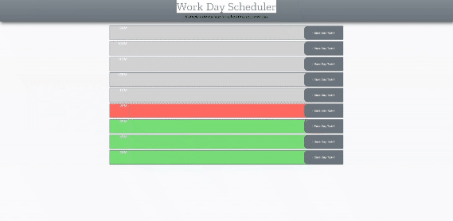

[#Homework Week V Day Scheduler Single Page App](https://rkutsel.github.io/js-day-scheduler/)

As with previous homeworks, my approach was to get closer to the user mockup
version of the app. Both are included bellow for reference. For the assignment I
used the latest stable release of
[Bootstrap](https://getbootstrap.com/docs/5.1/getting-started/introduction/) to
organize my HTML, [jQuery](https://jquery.com) library, which I didn't have to
use, but I felt like it would greatly simplify my JS footprint,
[Moment.js](https://momentjs.com) for that same purpose and lastly Zilla Slab
Highlight Google font. The end result meets the user story. In addition to that
it would be better to have another function that will track time without the
need for a user to refresh the page which I will most likely include in the
coming days. Link to the
[live page](https://rkutsel.github.io/js-day-scheduler/).

## User Story

```md
AS AN employee with a busy schedule I WANT to add important events to a daily
planner SO THAT I can manage my time effectively
```

## Acceptance Criteria

```md
GIVEN I am using a daily planner to create a schedule WHEN I open the planner
THEN the current day is displayed at the top of the calendar WHEN I scroll down
THEN I am presented with timeblocks for standard business hours WHEN I view the
timeblocks for that day THEN each timeblock is color coded to indicate whether
it is in the past, present, or future WHEN I click into a timeblock THEN I can
enter an event WHEN I click the save button for that timeblock THEN the text for
that event is saved in local storage WHEN I refresh the page THEN the saved
events persist
```

### My own mockup:



### Mockup from the user story:


